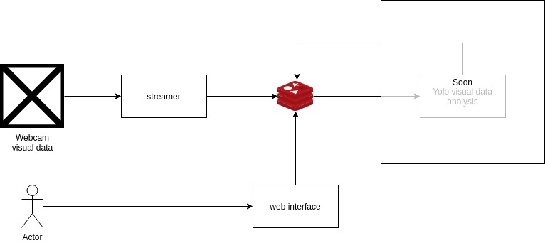

## ego-eye (opencv > redis stream)

This software will fetch frames from different visual data sources and streaming it into [redis stream ]([https://redis.io/topics/streams-intro](https://redis.io/topics/streams-intro)) The Stream is a new data type introduced with Redis 5.0, which models a_log data structure_in a more abstract way, after pushing the visual data into redis stream, another server will retrieve the visual data and process it as needed, For example, in our case, I'm planning to analysis each frame and get the object from it.

The reason for choosing the redis stream for this project:
* Redis streams are primarily an append-only data structure
* A stream can have multiple clients waiting for data.
* Collect large volumes of data arriving in high velocity
* Create a data channel between many producers and many consumers.

Requimnet:
1. Redis version > 5.
2. Python > 3.5
3. Any visual source.
4. python opencv
5. flask
6. python redis

### Note:
This project just for fun, I'm trying to learning visual data processing.

### Overview diagram

## Install
pip install -r requirements.txt

### Use

> To start retrieving visual data from webcam
* use `python server/visualDataStreamer.py`
> to start web server in order to liveview the stream from redis
* user `python webInterface/webServer.py`

To monitor data in redis `redis-cli monitor`

### To do

* Add multiple visual data source support as [video file, Camera URL].
* Do some basic visual data process and get objects from the stream.
* Make a web interface to show the stream data.